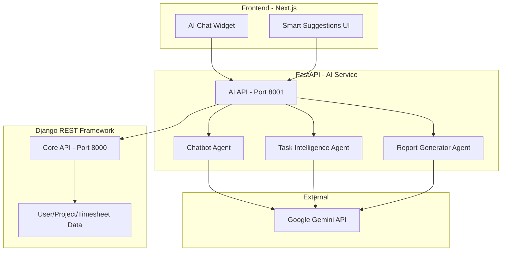

# 🤖 AGENTS.md - AI Agents & Intelligent Systems

> **🚧 Work in Progress**
> 
> AI features are planned for future implementation. This document describes the intended architecture and capabilities.

---

## Overview

The **LightIDEA Timesheet & Project Management System** will leverage **Google Gemini** AI to provide intelligent assistance, automation, and insights. AI features will be implemented using **FastAPI** as a separate microservice.

---

## 🏗️ Planned Architecture



---

## 🤖 Planned AI Agents

### 1. AI Chatbot Agent

**Status:** 📋 Planned

**Purpose:** Conversational AI assistant for project management queries.

| Feature | Description |
|---------|-------------|
| 📊 Dashboard Queries | Ask questions about stats, timesheets |
| 📋 Task Management | Create, update tasks via natural language |
| 💡 Recommendations | AI-powered prioritization suggestions |
| 🔍 Smart Search | Natural language search |

**Example:**
```
User: "Show me overdue tasks for Project Alpha"
Agent: "You have 3 overdue tasks in Project Alpha..."
```

---

### 2. Task Intelligence Agent

**Status:** 📋 Planned

**Purpose:** AI-powered task analysis and predictions.

| Feature | Description |
|---------|-------------|
| ⏱️ Deadline Prediction | ML-based completion time estimates |
| 🎯 Priority Scoring | Intelligent task prioritization |
| 👤 Smart Assignment | Suggests best team member for tasks |
| ⚠️ Risk Detection | Identifies tasks at risk |

---

### 3. Report Generator Agent

**Status:** 📋 Planned

**Purpose:** Automated report generation with insights.

| Feature | Description |
|---------|-------------|
| 📊 Executive Summaries | High-level status reports |
| 📈 Trend Analysis | Patterns in project data |
| 💬 Natural Language | Data as readable narratives |

---

## 🔧 Configuration (Future)

```bash
# Backend .env file
GEMINI_API_KEY=your-google-gemini-api-key
GEMINI_MODEL=gemini-2.0-flash-exp
AI_TEMPERATURE=0.7
```

---

## 📊 Current Implementation Status

| Component | Status | Notes |
|-----------|--------|-------|
| ✅ Django Core API | Complete | Users, Projects, Timesheets |
| ✅ Approval Workflow | Complete | Submit, approve, reject |
| 📋 FastAPI AI Service | Planned | Separate microservice |
| 📋 Chatbot Agent | Planned | Google Gemini integration |
| 📋 Task Intelligence | Planned | Deadline prediction |
| 📋 Report Generator | Planned | AI summaries |

---

## 🚀 Future Integration

### FastAPI AI Service Structure

```
ai_service/
├── main.py                    # FastAPI entry
├── config.py                  # Gemini configuration
├── routers/
│   ├── chatbot.py             # Chat endpoints
│   ├── predictions.py         # Task predictions
│   └── reports.py             # Report generation
└── services/
    └── gemini_service.py      # Gemini API wrapper
```

### Planned Endpoints

```http
POST /api/ai/chat              # Chat with AI
POST /api/ai/predict-deadline  # Deadline prediction
POST /api/ai/prioritize        # Task prioritization
POST /api/ai/suggest-assignee  # Smart assignment
POST /api/ai/generate-report   # Report generation
```

---

## 🔐 Security Considerations

- ✅ **No PII to AI:** Sensitive data will be anonymized
- ✅ **Encryption:** All AI traffic will be encrypted
- ✅ **RBAC:** AI features will respect user permissions
- ✅ **Audit Logging:** AI interactions will be logged
