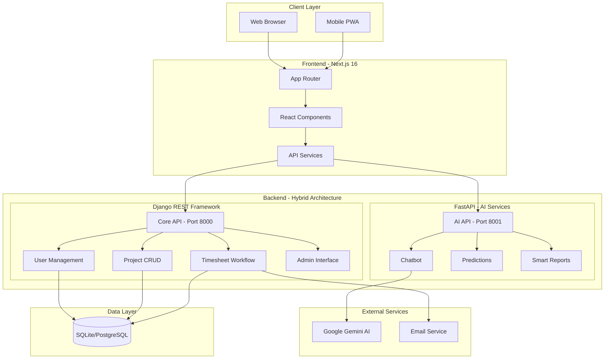
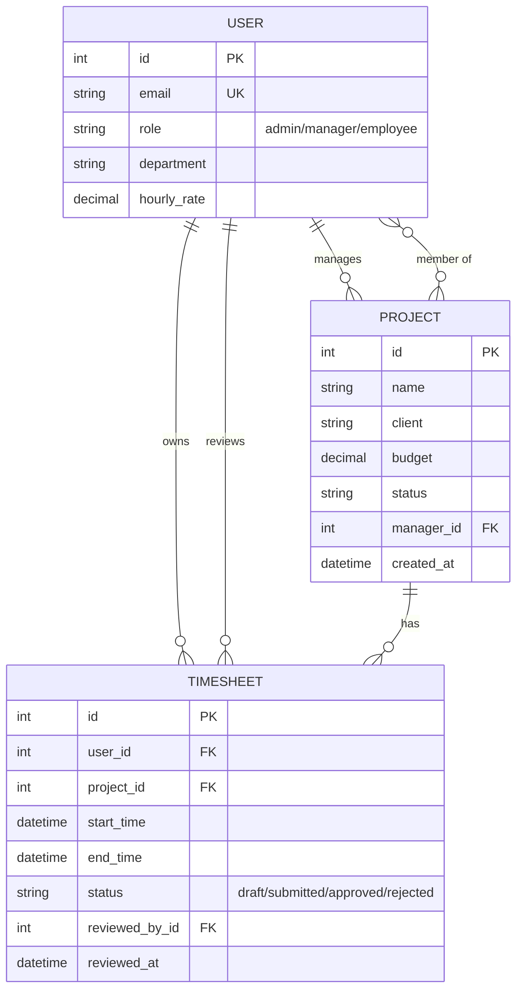
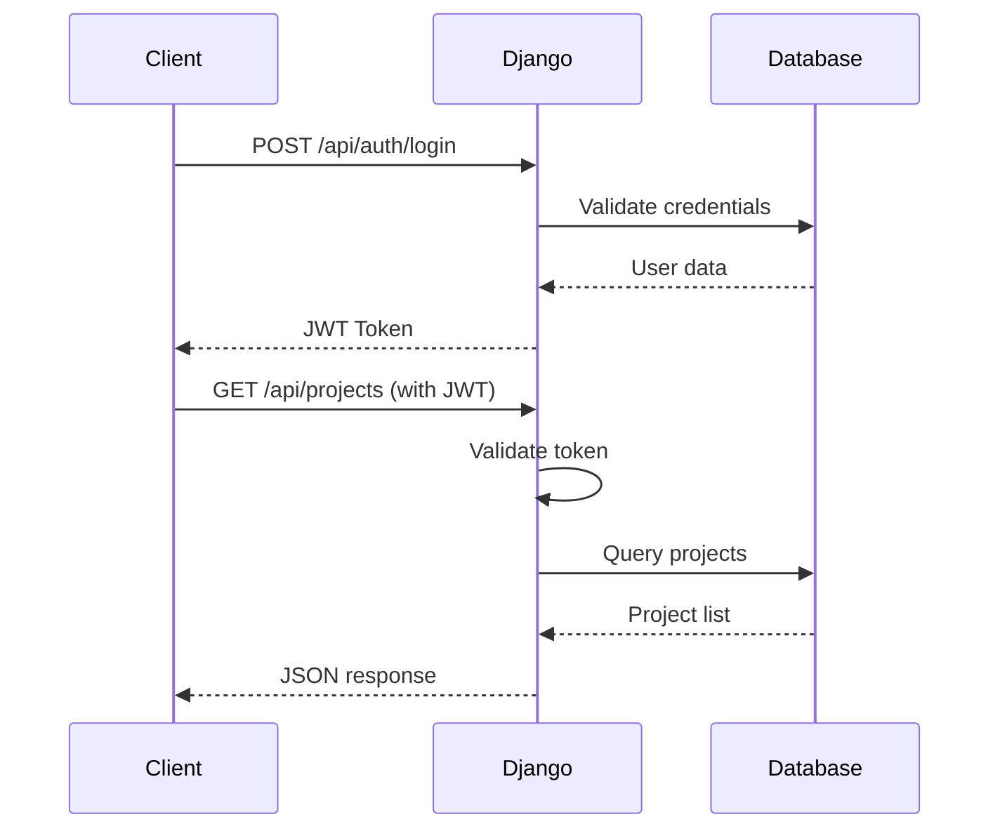
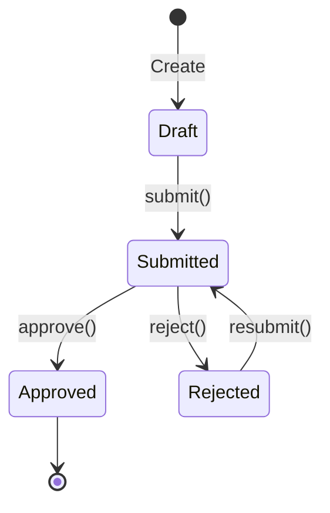

# 🏗️ Architecture Documentation

## Overview

LightIDEA uses a **hybrid backend architecture** combining Django REST Framework for core database operations and FastAPI for AI-powered features.

---

## 📐 System Architecture

### High-Level Architecture



---

## 🎯 Hybrid Backend Design

### Why Hybrid Architecture?

| Concern | Django REST Framework | FastAPI |
|---------|----------------------|---------|
| **Database CRUD** | ✅ Django ORM, Admin | ❌ |
| **Authentication** | ✅ Built-in auth | ❌ |
| **Approval Workflows** | ✅ Transaction management | ❌ |
| **AI/ML Services** | ❌ | ✅ Async, high-performance |
| **Real-time Streaming** | ❌ | ✅ WebSocket, SSE |
| **Admin Interface** | ✅ Django Admin | ❌ |

### Service Distribution

```
┌─────────────────────────────────────────────────────────────────┐
│              DJANGO REST FRAMEWORK (Port 8000)                  │
├─────────────────────────────────────────────────────────────────┤
│  Core Business Logic:                                           │
│  • User Management (CRUD, roles, permissions)                   │
│  • Project Management (create, update, members)                 │
│  • Timesheet Workflow (submit, approve, reject)                 │
│  • Admin Dashboard (Django Admin)                               │
│  • Authentication (JWT, session)                                │
│  • Approval Workflows (atomic transactions)                     │
└─────────────────────────────────────────────────────────────────┘

┌─────────────────────────────────────────────────────────────────┐
│                    FASTAPI (Port 8001)                          │
├─────────────────────────────────────────────────────────────────┤
│  AI-Powered Features:                                           │
│  • Google Gemini Chatbot                                        │
│  • Task Deadline Prediction                                     │
│  • Smart Task Prioritization                                    │
│  • Intelligent Assignee Suggestions                             │
│  • Automated Report Generation                                  │
│  • Real-time Streaming Responses                                │
└─────────────────────────────────────────────────────────────────┘
```

---

## 🗂️ Django Backend Structure

### Directory Layout

```
backend/
├── manage.py                    # Django CLI
├── requirements.txt             # Dependencies
├── db.sqlite3                   # SQLite database
│
├── backend/                     # Django project
│   ├── __init__.py
│   ├── settings.py              # Configuration
│   ├── urls.py                  # Root URL routing
│   └── wsgi.py                  # WSGI entry point
│
└── core/                        # Core application
    ├── __init__.py
    ├── apps.py                  # App configuration
    ├── admin.py                 # Admin registration
    ├── models.py                # Data models
    ├── views.py                 # API views
    └── urls.py                  # API routing
```

### Data Models (models.py)



### Custom Managers

| Manager | Purpose |
|---------|---------|
| `UserManager` | User creation, role filtering |
| `ProjectManager` | Access control, filtering by user |
| `TimesheetManager` | Approval queries, user filtering |

### Model Methods

| Model | Method | Description |
|-------|--------|-------------|
| `Timesheet` | `submit()` | Submit for approval |
| `Timesheet` | `approve(reviewer)` | Approve with atomic transaction |
| `Timesheet` | `reject(reviewer, reason)` | Reject with reason |

---

## 🔌 API Layer (views.py)

### Serializers

| Serializer | Fields |
|------------|--------|
| `UserSerializer` | email, role, full_name, can_approve |
| `ProjectSerializer` | name, client, budget, status, members |
| `TimesheetSerializer` | user, project, duration, hours, status |

### ViewSets

| ViewSet | Endpoints |
|---------|-----------|
| `UserViewSet` | `/api/users/`, `/api/users/me/` |
| `ProjectViewSet` | `/api/projects/`, `/api/projects/{id}/timesheets/` |
| `TimesheetViewSet` | `/api/timesheets/`, `/api/timesheets/{id}/submit/` |

### Permissions

| Permission Class | Rule |
|-----------------|------|
| `IsProjectManagerOrOwner` | Object-level access control |
| `IsAdminOrManager` | Admin or manager role required |

### SafeActionMixin

All ViewSets use `SafeActionMixin` for:
- Standardized error responses (JSON format)
- Exception logging
- Automatic Django→DRF ValidationError conversion

---

## 🔐 Security Architecture

### Authentication Flow



### Permission Hierarchy

```
ADMIN
├── Full system access
├── Create/delete users
├── Approve any timesheet
└── View all data

MANAGER
├── View team data
├── Approve team timesheets
├── Manage assigned projects
└── Cannot create users

EMPLOYEE
├── View own data only
├── Submit timesheets
├── View assigned projects
└── Cannot approve
```

---

## 🔄 Timesheet Approval Workflow



**Atomic Transactions:**
- `approve()` and `reject()` use `@transaction.atomic`
- Ensures data consistency during state changes

---

## 🚀 FastAPI AI Services (Planned)

### Future Integration

```
┌─────────────────────────────────────────────────────────────────┐
│                    FastAPI AI Service                           │
├─────────────────────────────────────────────────────────────────┤
│  POST /api/ai/chat          # Chatbot conversation              │
│  POST /api/ai/predict       # Deadline prediction               │
│  POST /api/ai/prioritize    # Task prioritization               │
│  POST /api/ai/suggest       # Assignee suggestions              │
│  GET  /api/ai/insights      # Project insights                  │
└─────────────────────────────────────────────────────────────────┘
```

### Google Gemini Integration

```python
import google.generativeai as genai

genai.configure(api_key=settings.GEMINI_API_KEY)
model = genai.GenerativeModel('gemini-2.0-flash-exp')

async def chat_with_ai(message: str, context: dict):
    prompt = build_prompt(message, context)
    response = await model.generate_content_async(prompt)
    return response.text
```

---

## 📊 Database Configuration

### Development (SQLite)

```python
DATABASES = {
    'default': {
        'ENGINE': 'django.db.backends.sqlite3',
        'NAME': BASE_DIR / 'db.sqlite3',
    }
}
```

### Production (PostgreSQL)

```python
DATABASES = {
    'default': {
        'ENGINE': 'django.db.backends.postgresql',
        'NAME': os.getenv('DB_NAME'),
        'USER': os.getenv('DB_USER'),
        'PASSWORD': os.getenv('DB_PASSWORD'),
        'HOST': os.getenv('DB_HOST'),
        'PORT': os.getenv('DB_PORT', '5432'),
    }
}
```

---

## 🛠️ Development Status

| Component | Status | Description |
|-----------|--------|-------------|
| ✅ Django Models | Complete | User, Project, Timesheet |
| ✅ Custom Managers | Complete | Query encapsulation |
| ✅ REST API | Complete | CRUD + actions |
| ✅ Permissions | Complete | Role-based access |
| ✅ Admin Interface | Complete | Django Admin |
| 🚧 Frontend | In Progress | React integration |
| 📋 FastAPI AI | Planned | Gemini chatbot |
