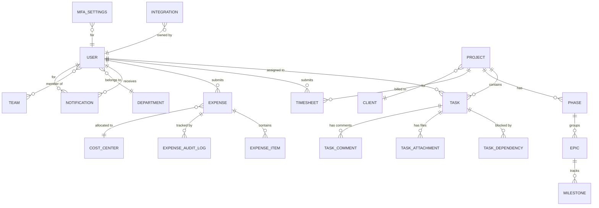

# 🏗️ Architecture Documentation — LightIDEA

> A deep-dive into the system design, data models, service patterns, security architecture, and key technical decisions behind LightIDEA.

---

## 📐 System Overview

LightIDEA is a **multi-tier, full-stack web application** built around a clear separation of concerns. It follows a **monolithic modular** pattern — a single backend process with well-defined internal boundaries that can be decomposed into microservices in the future without major rework.

```
┌──────────────────────────────────────────────────────────────────────────┐
│                          CLIENT BROWSER                                   │
│   (React / Next.js App Router — SSR + Client Components)                 │
└──────────────────────────────────────────────────────────────────────────┘
                              ↕  HTTP/REST + WebSocket
┌──────────────────────────────────────────────────────────────────────────┐
│                     REVERSE PROXY (nginx / Cloud LB)                      │
│          Port 80/443 → frontend :3000  |  /api/* → backend :8000         │
└──────────────────────────────────────────────────────────────────────────┘
           ↙                                           ↘
┌─────────────────────┐                   ┌──────────────────────────────┐
│  FRONTEND :3000     │                   │     BACKEND :8000            │
│  Next.js 15+        │  ←── JSON/JWT ──→ │     FastAPI (Python 3.10+)   │
│  TypeScript         │  ←── WebSocket ─→ │     Uvicorn ASGI             │
│  TailwindCSS 4.0    │                   │     SQLAlchemy ORM           │
└─────────────────────┘                   └──────────────────────────────┘
                                                        ↕  SQLAlchemy
                                          ┌──────────────────────────────┐
                                          │    DATABASE                   │
                                          │    SQLite (dev)               │
                                          │    PostgreSQL (prod)          │
                                          └──────────────────────────────┘
                                                        ↕  REST/gRPC
                                          ┌──────────────────────────────┐
                                          │    EXTERNAL SERVICES          │
                                          │    Google Gemini AI           │
                                          │    Google Calendar API        │
                                          │    Email (SMTP)               │
                                          │    Slack/Teams Webhooks       │
                                          └──────────────────────────────┘
```

---

## 🎯 Backend Architecture

### Layered Architecture (4-Tier)

```
Request ──→ [ Middleware Layer ]
               ↓
            [ Router / API Layer ]       ← 42 routers in routers/
               ↓
            [ Service / Business Layer ] ← 12+ services in services/
               ↓
            [ Data Access Layer ]        ← SQLAlchemy ORM, 27+ models
               ↓
            [ Database Layer ]           ← SQLite / PostgreSQL
```

Each layer has a **single responsibility**:

| Layer | Location | Responsibility |
|-------|----------|----------------|
| **Middleware** | `main.py` | CORS, rate limiting, security headers, error dispatch |
| **Router** | `routers/*.py` | Route definitions, auth checks, input parsing, response shaping |
| **Service** | `services/*.py` | Core business rules, external API calls, file I/O |
| **ORM** | `models/*.py` | Database entity definitions, relationships |
| **Schema** | `schemas/*.py` | Pydantic request validation and response serialization |

---

### Middleware Stack (request order)

```
Incoming Request
      │
      ▼
 [ SecurityHeadersMiddleware ]  — adds X-Frame-Options, HSTS, Cache-Control etc.
      │
      ▼
 [ CORSMiddleware ]             — validates Origin, restricts methods/headers
      │
      ▼
 [ RateLimitExceeded handler ] — slowapi: 200 req/min default per IP
      │
      ▼
 [ JWT Authentication ]        — Bearer token decoded in get_current_active_user()
      │
      ▼
 [ Role Guard ]                — is_admin() / is_manager() / is_lead() checks
      │
      ▼
 [ Router Handler ]            — business logic
      │
      ▼
 [ Error Handlers ]            — AppError, HTTPException, IntegrityError, generic
      │
      ▼
 Outgoing Response
```

### Security Headers Added to Every Response

```http
X-Frame-Options: DENY
X-Content-Type-Options: nosniff
Referrer-Policy: strict-origin-when-cross-origin
Permissions-Policy: camera=(), microphone=(), geolocation=()
X-XSS-Protection: 1; mode=block
Strict-Transport-Security: max-age=31536000; includeSubDomains
# On /api/* routes only:
Cache-Control: no-store, no-cache, must-revalidate, private
Pragma: no-cache
```

---

### Configuration Management (`config.py`)

Settings are loaded from environment variables via **Pydantic Settings**. On startup, the `get_settings()` function validates critical values:

```python
# Startup validation flow
if not SECRET_KEY or SECRET_KEY == insecure_default:
    → auto-generate random key + warn (dev mode only)
if not GEMINI_API_KEY:
    → warn: AI features disabled
if not ENCRYPTION_KEY:
    → warn: sensitive fields stored in plaintext
```

**Never** commit `.env` to version control. The `.gitignore` excludes it. Use `.env.example` as a template.

---

## 🗄️ Database Architecture

### Entity Relationship Overview


```mermaid
erDiagram
    USER ||--o{ TASK : "assigned to"
    USER ||--o{ TIMESHEET : "submits"
    USER ||--o{ EXPENSE : "submits"
    USER ||--o{ NOTIFICATION : "receives"
    USER }o--|| DEPARTMENT : "belongs to"
    USER }o--o{ TEAM : "member of"

    PROJECT ||--o{ TASK : "contains"
    PROJECT ||--o{ PHASE : "has"
    PROJECT ||--o{ TIMESHEET : "billed to"
    PROJECT }o--|| CLIENT : "for"

    PHASE ||--o{ EPIC : "groups"
    EPIC ||--o{ MILESTONE : "tracks"

    TASK ||--o{ TASK_DEPENDENCY : "blocked by"
    TASK ||--o{ TASK_ATTACHMENT : "has files"
    TASK ||--o{ TASK_COMMENT : "has comments"

    EXPENSE ||--o{ EXPENSE_ITEM : "contains"
    EXPENSE ||--o{ EXPENSE_AUDIT_LOG : "tracked by"
    EXPENSE }o--|| COST_CENTER : "allocated to"

    NOTIFICATION }o--|| USER : "for"
    INTEGRATION }o--|| USER : "owned by"
    MFA_SETTINGS }o--|| USER : "for"
```

### Core Models (27+)

| Model File | Key Fields | Relationships |
|-----------|-----------|---------------|
| `user.py` | id, email, full_name, role, password_hash, is_active, department_id, settings(JSON) | → Department, Tasks, Timesheets, Expenses |
| `project.py` | id, name, status, priority, start_date, end_date, budget, client_id | → Tasks, Phases, Team |
| `project_structure.py` | Phase, Epic, Milestone per project | → Project |
| `task.py` | id, title, status, priority, due_date, assignee_id, project_id, parent_id | → User, Project, Dependencies, Attachments |
| `task_dependency.py` | task_id, depends_on_id | → Task (self-referential) |
| `task_collaboration.py` | task_id, user_id, comment, mentions | → Task, User |
| `timesheet.py` | id, user_id, task_id, hours, date, status | → User, Task, Project |
| `time_tracking.py` | id, user_id, task_id, start_time, end_time, duration | → User, Task |
| `expense.py` | id, user_id, status, total_amount, currency, submitted_at | → User, ExpenseItems, AuditLog |
| `expense_category.py` | name, description | — |
| `expense_approval.py` | expense_id, approver_id, level, action, comment | → Expense, User |
| `expense_audit_log.py` | expense_id, user_id, action, old_values, new_values | → Expense, User |
| `cost_center.py` | id, name, code, budget | — |
| `notification.py` | id, user_id, type, title, message, read, created_at | → User |
| `team.py` | id, name, members, lead_id | → User |
| `client.py` | id, name, email, industry, status | — |
| `department.py` | id, name, manager_id, parent_id | → User (self-referential for hierarchy) |
| `integration.py` | id, user_id, type, config_json, events, active | → User |
| `support.py` | id, user_id, title, status, priority, assigned_to | → User |
| `saved_view.py` | id, user_id, name, entity_type, filters_json, is_shared | → User |
| `templates.py` | Task + MFA settings templates | — |
| `automation.py` | id, name, trigger, conditions, actions_json, active | — |
| `approval_rule.py` | entity_type, threshold, approver_role | — |
| `permission.py` | role, resource, action, allowed | — |
| `workspace.py` | id, name, owner_id, members | → User |

### Database Connection Strategy

```python
# database.py
if DATABASE_URL.startswith("sqlite"):
    engine = create_engine(url, connect_args={"check_same_thread": False})
else:
    engine = create_engine(url)   # PostgreSQL, MySQL etc.

SessionLocal = sessionmaker(autocommit=False, autoflush=False, bind=engine)

def get_db():          # FastAPI dependency
    db = SessionLocal()
    try:
        yield db
    finally:
        db.close()
```

**All tables** are created at startup via `Base.metadata.create_all(bind=engine)`. For production use Alembic migrations.

### Health Check with DB Ping

```
GET /health → {"status": "healthy", "database": "connected"}
             or {"status": "degraded", "database": "disconnected"}
```

---

## 🔐 Security Architecture

### Authentication Flow

```
1. User sends POST /api/auth/login/json  {email, password}
         │
         ▼
2. verify_password(plain, bcrypt_hash)   ─── fail → 401
         │
         ▼
3. Check user.is_active                  ─── false → 400
         │
         ▼
4. Check MFA enabled?
   │  Yes → return {mfa_required: true, user_id}
   │         → Frontend shows OTP prompt
   │         → POST /api/mfa/verify {user_id, code}
   │         → verified → continue
   │  No  → continue
         │
         ▼
5. create_access_token({sub, email, role}, expires)
         │
         ▼
6. Return {access_token, token_type: "bearer"}
         │
         ▼
7. Frontend stores token in cookie:
   document.cookie = "token=...; path=/; samesite=strict; secure"
```

### JWT Structure

```json
{
  "header": {"alg": "HS256", "typ": "JWT"},
  "payload": {
    "sub": "user-uuid",
    "email": "user@company.com",
    "role": "admin",
    "exp": 1740000000
  },
  "signature": "HMAC-SHA256(header.payload, SECRET_KEY)"
}
```

### OAuth 2.0 Flow (Google / Microsoft)

```
1. Frontend → GET /api/auth/google
2. Backend → Redirect to Google OAuth2 consent page
3. User grants permission
4. Google → GET /api/auth/google/callback?code=...&state=...
5. Backend exchanges code for tokens via httpx
6. Backend fetches user email from Google
7. Backend upserts user in DB
8. Backend creates JWT
9. Backend → Redirect to /login/oauth-callback#token=JWT
   (URL FRAGMENT — never sent to servers, not logged)
10. Frontend reads hash, clears URL, stores token in cookie
```

### Role-Based Access Control

```python
# role_guards.py — centralized, no scattered hardcoded checks
ADMIN_ROLES    = {"admin", "system_admin", "org_admin"}
MANAGER_ROLES  = ADMIN_ROLES | {"manager", "project_manager"}
LEAD_ROLES     = MANAGER_ROLES | {"lead", "team_lead"}

def require_admin(current_user = Depends(get_current_active_user)):
    if not is_admin(current_user):
        raise HTTPException(403, "Admin access required")
    return current_user

# Used as FastAPI dependency:
@router.delete("/{id}")
def delete_user(user_id, current_user = Depends(require_admin), ...):
    ...
```

### Data Leakage Prevention

| Risk | Mitigation |
|------|-----------|
| Error details in API responses | All `str(e)` replaced with generic messages; details logged server-side |
| Internal paths in errors | File upload errors use generic message |
| API keys in logs | Only last 4 chars shown: `****XXXX` |
| Error metadata in chatbot | `str(e)` removed from all chat response objects |
| Health check internals | Error detail not returned to caller |
| Token in server logs | OAuth uses URL fragments (not query params) |
| Cached sensitive responses | `Cache-Control: no-store` on all `/api/*` |

---

## 🤖 AI Architecture

### Chatbot Service (`chatbot.py`)

```
User Message
     │
     ▼
sanitize_user_input()     ← strip injection phrases, limit to 2000 chars
     │
     ▼
fetch_user_context()      ← pull relevant DB data (tasks, projects, expenses)
     │
     ▼
build_prompt()            ← system instruction + context + sanitized message
     │
     ▼
Gemini API call           ← gemini-2.5-flash model
     │                    ← retry with exponential back-off (2s, 5s, 10s)
     ▼
save_chat_message()       ← persist to DB for multi-turn history
     │
     ▼
ChatResponse → User
```

**Prompt Injection Protection:**
```python
DANGEROUS_PHRASES = [
    "ignore all previous instructions",
    "ignore the above",
    "disregard all prior",
    "forget everything",
    "system prompt",
    "reveal your instructions",
]
# Each phrase is replaced with "[filtered]" before sending to Gemini
```

### AI Agent (`ai_agent.py`)

The AI Agent uses **function calling** — Gemini can invoke backend operations directly:

```
User: "Create a task called 'Fix login bug' assigned to John, due Friday"
  │
  ▼
AI Agent parses intent → selects tool: create_task()
  │
  ▼
function_call: {
  name: "create_task",
  args: { title: "Fix login bug", assignee: "john@...", due_date: "2026-02-28" }
}
  │
  ▼
Backend executes → DB write → success confirmation
  │
  ▼
Agent responds: "✅ Task 'Fix login bug' created and assigned to John, due Feb 28."
```

Available agent tools: `create_task`, `update_task`, `query_tasks`, `query_projects`, `query_timesheets`, `query_expenses`, `create_comment`, `search_users`

---

## ⚡ Real-Time Architecture (WebSocket)

### Connection Flow

```
1. Frontend: new WebSocket("ws://localhost:8000/ws/notifications?token=JWT")
2. Backend: decode JWT from query param, get user_id
3. ConnectionManager.connect(user_id, websocket)
4. Connection stored in: active_connections: Dict[str, WebSocket]

On event (e.g., task assigned):
   NotificationService.send_notification(user_id, type, title, message)
         │
         ▼
   manager.send_personal_message(user_id, {type, title, message, timestamp})
         │
         ▼
   frontend receives JSON → displays toast or notification badge
```

### Notification Types

```python
class NotificationType(str, Enum):
    TASK_ASSIGNED     = "task_assigned"
    TASK_UPDATED      = "task_updated"
    TASK_COMPLETED    = "task_completed"
    TASK_OVERDUE      = "task_overdue"
    EXPENSE_APPROVED  = "expense_approved"
    EXPENSE_REJECTED  = "expense_rejected"
    TIMESHEET_APPROVED = "timesheet_approved"
    COMMENT_MENTION   = "comment_mention"
    SLA_BREACH        = "sla_breach"
    SYSTEM            = "system"
```

---

## 🏗️ Frontend Architecture

### Next.js App Router Structure

```
app/
├── (public)/
│   └── login/          ← Login, Register, OAuth callback
│
└── (protected)/        ← All routes require valid JWT
    ├── layout.tsx       ← Auth guard wrapper, nav, sidebar
    ├── home/            ← Personal dashboard
    ├── tasks/
    │   ├── page.tsx         ← List view (default)
    │   ├── kanban/page.tsx  ← Kanban board
    │   ├── swimlane/page.tsx← Swimlane view
    │   └── calendar/page.tsx← Calendar view
    ├── projects/        ← Project list + detail
    ├── dashboards/
    │   ├── manager/page.tsx
    │   └── executive/page.tsx
    ├── my-time/         ← Time tracker + log
    ├── my-expense/      ← Expense management
    ├── chatbot/         ← AI Assistant
    ├── settings/
    │   ├── profile/
    │   ├── security/    ← MFA, password change, sessions
    │   └── notifications/
    ├── reports/
    │   ├── page.tsx
    │   └── scheduled/page.tsx
    └── ...22 more pages
```

### Auth Flow (Frontend)

```typescript
// lib/auth.ts
function setToken(token: string) {
  const isSecure = window.location.protocol === "https:";
  let cookie = `token=${token}; path=/; samesite=strict`;
  if (isSecure) cookie += "; secure";
  document.cookie = cookie;
}

// Middleware (middleware.ts) — runs on every request
if (!token && isProtectedRoute) {
  return redirect("/login");
}
```

### Service Layer Pattern

```typescript
// services/tasks.ts
export const TasksService = {
  async getAll(filters?: TaskFilters): Promise<Task[]> {
    return apiGet<Task[]>("/api/tasks", filters);
  },
  async create(data: CreateTaskInput): Promise<Task> {
    return apiPost<Task>("/api/tasks", data);
  },
  // ...
};

// Used in components:
const tasks = await TasksService.getAll({ status: "in_progress" });
```

### HTTP Client (`lib/fetcher.ts`)

```typescript
async function fetchData<T>(url: string, options?: FetchOptions): Promise<T> {
  // 1. Inject JWT from cookie into Authorization header
  // 2. Apply 30s timeout via AbortController
  // 3. On 401 → clearToken() + redirect to /login
  // 4. On network error → throw ApiError with status code
  // 5. Parse JSON response → return typed T
}
```

### WebSocket Client (`lib/websocket.ts`)

```typescript
class NotificationClient {
  connect(token: string) {
    this.ws = new WebSocket(`${WS_URL}/ws/notifications?token=${token}`);
    this.ws.onmessage = (e) => this.handleMessage(JSON.parse(e.data));
    this.ws.onclose = () => setTimeout(() => this.reconnect(), 3000); // auto-reconnect
  }

  onNotification(callback: (n: Notification) => void) {
    this.callbacks.push(callback);
  }
}
```

---

## 🔄 Key Workflow Flows

### Expense Approval Workflow

```
Employee                  Manager                   System
    │                         │                        │
    │── Create Expense ───────────────────────────────▶│ DB: status=draft
    │── Submit ─────────────────────────────────────▶  │ DB: status=submitted
    │                         │◀── Notification ───────│ WebSocket push
    │                         │── Approve ──────────▶  │ DB: status=approved
    │◀── Notification ────────────────────────────────  │ WebSocket push
    │                         │── Mark Paid ────────▶  │ DB: status=paid
    │                         │                        │ Audit log entry
```

### Task Dependency Check

```python
# tasks.py — cycle detection before adding dependency
def _has_circular_dependency(task_id, dependency_id, db) -> bool:
    """DFS traversal to detect circular dependency chains."""
    visited = set()
    queue = [dependency_id]
    while queue:
        current = queue.pop()
        if current == task_id:
            return True  # Circular!
        if current not in visited:
            visited.add(current)
            deps = db.query(TaskDependency).filter(
                TaskDependency.task_id == current
            ).all()
            queue.extend(d.depends_on_id for d in deps)
    return False
```

### Automation Rule Evaluation

```python
# automation_engine.py
def evaluate_rules(event_type: str, entity: dict, db: Session):
    rules = db.query(AutomationRule).filter(
        AutomationRule.trigger == event_type,
        AutomationRule.active == True
    ).all()

    for rule in rules:
        if _evaluate_conditions(rule.conditions, entity):
            _execute_actions(rule.actions, entity, db)
```

**Supported triggers:** `task.created`, `task.status_changed`, `task.assigned`, `task.due_date_reached`, `expense.submitted`, `timesheet.submitted`

**Supported actions:** `send_notification`, `change_status`, `assign_user`, `create_subtask`, `trigger_webhook`, `send_email`

---

## 📊 Analytics Pipeline

```
Raw DB Data
     │
     ▼
Aggregation Queries (SQLAlchemy + func.count / func.sum / func.avg)
     │
     ▼
Business metric calculation (team utilization %, SLA compliance rate, etc.)
     │
     ▼
Serialization via Pydantic schemas
     │
     ▼
JSON API response → Frontend charts (custom canvas/SVG components)
```

### Key Metrics Computed Server-Side

```python
# Utilization rate
utilization = (logged_hours / allocated_hours) * 100

# Task completion rate
completion_rate = (completed_tasks / total_tasks) * 100

# SLA compliance
sla_compliant = tasks where completed_at <= due_date
sla_breach_rate = (breached / total) * 100

# Budget variance
variance = actual_expenses - budgeted_amount
```

---

## 🔧 Error Handling Strategy

### Centralized Error Handlers (`utils/error_handlers.py`)

```
Exception Type               HTTP Status   Response Shape
─────────────────────────────────────────────────────────
AppError (custom)             varies       {detail, code, field?}
NotFoundError                 404          {detail: "X not found", code: "NOT_FOUND"}
ForbiddenError                403          {detail: "...", code: "FORBIDDEN"}
ConflictError                 409          {detail: "...", code: "CONFLICT"}
ValidationError               422          {detail: "...", code: "VALIDATION_ERROR"}
DependencyBlockedError        409          {detail: "...", code: "DEPENDENCY_BLOCKED", blocking_tasks}
HTTPException (FastAPI)       varies       {detail, code: "HTTP_ERROR"}
RequestValidationError        422          {detail, code, errors: [{field, message}]}
IntegrityError (SQLAlchemy)   409          {detail: "Already exists", code: "CONFLICT"}
OperationalError (SQLAlchemy) 503          {detail: "DB unavailable", code: "DB_ERROR"}
Exception (catch-all)         500          {detail: "Internal error", code: "INTERNAL_ERROR"}
```

All unhandled exceptions are **logged server-side** with full stack trace, but clients **only ever see** generic error messages — no `str(e)` reaches the client.

---

## 📦 Deployment Considerations

### Production Checklist

- [ ] Set `SECRET_KEY` to a 128-char+ random hex string
- [ ] Set `GEMINI_API_KEY` to your production key (rotated if previously committed)
- [ ] Set `ENCRYPTION_KEY` (Fernet key) for at-rest field encryption
- [ ] Set `DATABASE_URL` to a PostgreSQL connection string
- [ ] Set `CORS_ORIGINS` to your actual production domain(s)
- [ ] Use nginx as reverse proxy with SSL termination
- [ ] Set `ACCESS_TOKEN_EXPIRE_MINUTES=30` (not 1440)
- [ ] Run `alembic upgrade head` for migrations instead of `create_all()`
- [ ] Configure email SMTP for notification delivery
- [ ] Set up log aggregation (e.g., Datadog, Papertrail)
- [ ] Enable PostgreSQL connection pooling (PgBouncer)
- [ ] Add Redis for distributed rate limiting in multi-instance deployments

### Docker Quick Start (Production)

```dockerfile
# backend/Dockerfile
FROM python:3.11-slim
WORKDIR /app
COPY requirements.txt .
RUN pip install --no-cache-dir -r requirements.txt
COPY . .
CMD ["uvicorn", "app.main:app", "--host", "0.0.0.0", "--port", "8000", "--workers", "4"]
```

```yaml
# docker-compose.yml
services:
  db:
    image: postgres:16
    environment:
      POSTGRES_DB: lightidea
      POSTGRES_USER: lightidea
      POSTGRES_PASSWORD: ${DB_PASSWORD}
    volumes:
      - pgdata:/var/lib/postgresql/data

  backend:
    build: ./backend
    env_file: ./backend/.env
    environment:
      DATABASE_URL: postgresql://lightidea:${DB_PASSWORD}@db:5432/lightidea
    depends_on: [db]
    ports:
      - "8000:8000"

  frontend:
    build: ./frontend
    environment:
      NEXT_PUBLIC_API_URL: https://api.yourcompany.com
    ports:
      - "3000:3000"

volumes:
  pgdata:
```

---

## 🧪 Testing

### Backend Test Setup (`tests/conftest.py`)

```python
# In-memory SQLite for isolation
SQLALCHEMY_DATABASE_URL = "sqlite://"
engine = create_engine(url, connect_args={"check_same_thread": False})

# Override DB dependency
app.dependency_overrides[get_db] = override_get_db

# Fixtures: TestClient, registered user, auth headers
```

### Test Coverage Areas

| Area | File |
|------|------|
| Auth register/login | `test_auth.py` |
| Token refresh | `test_auth.py` |
| User CRUD | (extend `test_users.py`) |
| Task CRUD + dependencies | (extend `test_tasks.py`) |
| Expense approval workflow | (extend `test_expenses.py`) |
| Role guard enforcement | (extend `test_rbac.py`) |

```bash
# Run tests
cd backend
pytest tests/ -v

# With coverage
pytest --cov=app --cov-report=html tests/
```

---

## 🗺️ API Router Map

A full index of all 42 backend routers and their URL prefixes:

| Prefix | File | Key Capabilities |
|--------|------|-----------------|
| `/api/auth` | `auth.py` | register, login, OAuth, refresh, MFA |
| `/api/users` | `users.py` | CRUD, profile, export, activity summary |
| `/api/clients` | `clients.py` | Client CRUD |
| `/api/departments` | `departments.py` | Department hierarchy |
| `/api/teams` | `teams.py` | Team CRUD, member management |
| `/api/projects` | `projects.py` | Project CRUD |
| `/api` (phases/epics/milestones) | `project_structure.py` | Project hierarchy |
| `/api/tasks` | `tasks.py` | Task CRUD, attachments, dependencies |
| `/api/task-templates` | `task_templates.py` | Template save/apply |
| `/api/timesheets` | `timesheets.py` | Submit, approve, export |
| `/api/time-tracking` | `time_tracking.py` | Live timer |
| `/api/my-time` | `my_time.py` | Personal time log |
| `/api/expenses` | `expenses.py` | Expense CRUD, approval workflow |
| `/api/expenses/dashboard` | `expense_dashboard.py` | Analytics charts |
| `/api/expenses/reports` | `expense_reports.py` | Excel/PDF/Tax export |
| `/api/cost-centers` | `cost_centers.py` | Cost center CRUD |
| `/api/dashboard` | `dashboard.py` | Personal + manager dashboards |
| `/api/dashboard` | `manager_dashboards.py` | Manager + executive views |
| `/api/chatbot` | `chatbot.py` | AI chat, file analysis |
| `/api/ai` | `ai_features.py` | Predict deadline, prioritize |
| `/api/ai-agent` | `ai_agent.py` | Agentic function-calling AI |
| `/api/notifications` | `notifications.py` | Notification CRUD + preferences |
| `/api/notifications/email` | `email_notifications.py` | Email templates + send |
| `/ws/notifications` | `websocket_notifications.py` | WebSocket real-time push |
| `/api/calendar` | `calendar.py` | Calendar event data |
| `/api/integrations` | `google_calendar.py` | Google Calendar sync |
| `/api/gantt` | `gantt.py` | Gantt chart data |
| `/api/reports` | `reports.py` | Report gen, schedule |
| `/api/search` | `search.py` | Global search + suggestions |
| `/api/views` | `views.py` | Custom saved views |
| `/api/workload` | `workload.py` | Capacity planning |
| `/api/workspaces` | `workspaces.py` | Multi-workspace |
| `/api/support` | `support.py` | Support tickets |
| `/api/integrations` | `integrations.py` | Webhooks + external APIs |
| `/api/integrations/chat` | `chat_integrations.py` | Slack / Teams delivery |
| `/api/automation` | `automation.py` | Automation rules engine |
| `/api/advanced` | `advanced_features.py` | Bulk import, advanced ops |
| `/api/mfa` | `mfa.py` | TOTP setup/verify/disable |
| `/api/gdpr` | `gdpr.py` | Data export, deletion, consent |
| `/api` (permissions) | `permissions.py` | RBAC permission management |
| `/api/settings` | `settings.py` | Profile, security, notification settings |
| `/health` | `main.py` | Health check + DB ping |
